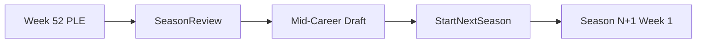

# Mechanics Review — Final Discussion Plan

**Primary review lens:** play-feel targets, pacing, injury frequency, and CPU fairness.

---

## Locked decisions (updated)


| Topic                       | Decision                                                                                                                                              |
| --------------------------- | ----------------------------------------------------------------------------------------------------------------------------------------------------- |
| Draft budgets               | **$2M** or **Unlimited** only                                                                                                                         |
| CPU draft budget            | **Same as player**, same affordability rules                                                                                                          |
| Difficulty + money          | **Does not affect starting budget**                                                                                                                   |
| PLE cadence                 | 4 TV + PLE per cycle → **52 weeks / 13 PLEs**                                                                                                         |
| **Multi-season**            | Game must support **ongoing careers** — **mid-career draft required** (not optional)                                                                  |
| Open Challenge opponent     | **Momentum-weighted hash bias** (stars slightly more likely to answer; still hidden pre-show)                                                         |
| **Open Challenge + title**  | **Title on the line when `championshipId` is set** — must be added (not supported today)                                                              |
| Momentum Advance Week decay | **Reject current rules** (−4 unbooked / −2 elite). **Adopt retune below + top-star decay**                                                            |
| Injury                      | **Compounding weekly fight risk** (softer table: +2/+4/+6/+8 by difficulty) + duration load + difficulty scaling; shared CPU engine |
| Sentiment model             | **Options A + B + C combined:** `morale` + `audienceHeat` + `trust`                                                                                   |
| Tag records                 | **Individual wrestler W-L** from tag matches counts on each superstar's record                                                                        |
| **Top-star decay**          | **B — light:** **−2** extra on Advance Week when pop ≥80, momentum ≥85, and appeared this week                                                        |
| **Overpush backlash**       | **Combo D:** **5+ consecutive TV weeks** → −3 mom; **7+** → −5; `**push_complaint`** social post naming wrestler → extra **−2** + **audienceHeat −4** |
| **52-week save migration**  | **New careers only.** Existing 12-week in-progress saves are not migrated — players start fresh careers for 52-week mode                              |
| **Mid-career draft budget** | **Money resets** at offseason draft — **$2M** fresh war chest (Unlimited unchanged); **end-of-season bank balance wipes**; **unspent draft cash becomes Week 1 money** |
| **Mid-career draft order**  | **Worst ratings/market-share placement picks first** (4-brand order from season-end ratings battle); CPU rivals same rules                            |
| **Roster caps**             | **No hard wrestler cap** for player or CPU rival brands; roster size can create advisory pressure but must not block drafting/signing by count alone   |
| **Mid-career draft picks**  | **No hard pick minimum**; tune prices so $2M can reasonably buy about **4–6 top stars + 6–10 midcarders**                                             |
| **Contract payment model**  | Draft picks receive **52-week prepaid contracts**; in-season signings/renewals use player-chosen weeks × weekly ask, paid fully up front              |
| **CPU parity**              | **C — full parity:** shared scoring, winners, injury, momentum decay, overpush rules, and social fallout on CPU roster (hidden, same math)            |


---

## 0. Multi-season viability + mid-career draft (NEW — required)

### Does the game only work for one season today?

**Not exactly one season — but roster refresh is thin after Season 1.**

The game **can** continue: `Start Next Season` rolls forward money, champions, rivalries, history, and contracted roster (`[startNextSeason](src/game/advanceWeek.ts)`). But:

- **Draft Night exists only at new-game setup** — no mid-career or offseason draft
- Opening contracts are **12 weeks** today → most talent expires at season end unless renewed
- Post-season roster churn = **Market only** (weekly board, sign/renew/release/trade)
- CPU rivals get no offseason draft either — rosters persist as-is

So multi-season **works mechanically**, but it was **not designed for deep year-over-year roster rebuilding** without Market.

### Required feature: Mid-Career Draft v1

**User decision:** Include mid-career draft — not defer.

**Proposed flow:**




**Scope sketch (to detail in design ticket):**


| Element           | Proposal                                                                                                                                             |
| ----------------- | ---------------------------------------------------------------------------------------------------------------------------------------------------- |
| When              | Between **Season Review** and **Start Next Season** (or as first step of new season before Week 1)                                                   |
| Pool              | Free agents + undrafted pool wrestlers not on any brand (reuse Top 200 / market pool)                                                                |
| Budget            | **Resets to $2M** (or Unlimited) at draft; **season ending `money` is wiped**; unspent draft cash becomes Week 1 money                               |
| CPU rivals        | Parallel CPU draft; **same $2M/Unlimited reset**; **pick order by inverse season ratings rank** (worst first)                                        |
| Pick order source | `[getRatingsBattleSnapshot](src/game/cpuRivalLoop.ts)` season-end rank — rank 4 picks before rank 1                                                  |
| Roster cap        | **No hard player or CPU cap.** Roster size can be surfaced as pressure/advisory context, but count alone must not block draft picks or signings       |
| Contracts         | Drafted wrestlers get **52-week prepaid contracts**                                                                                                  |
| Pick count        | **No hard minimum.** Economy tuning should make a normal $2M haul land around **4–6 top stars + 6–10 midcarders** if the player spends sensibly       |

### Contract and market rules from follow-up

- Drafted wrestlers: 52-week prepaid contract.
- In-season hires: player chooses contract length; cost is wrestler weekly ask × selected weeks; full contract value is paid up front.
- Recommended implementation default: allow in-season contracts up to 52 weeks, and cap renewals at 52 weeks remaining unless a future ticket asks for multi-season contract stacking.
- Affordability is cash-based, not roster-count-based.


**Files likely touched:** new `midCareerDraft.ts` (reuse `[openingDraft.ts](src/game/openingDraft.ts)` sim), `[App.tsx](src/App.tsx)` offseason screen, `[advanceWeek.ts](src/game/advanceWeek.ts)`, `[seed.ts](src/game/seed.ts)`, `[types.ts](src/game/types.ts)`

---

## A. Open Challenge — opponent selection + title on the line

### Who answers (today + approved change)

Hidden until Run Show. Eligible pool filtered by division, availability, protected rest. Prefer unbooked tonight.

**Approved:** Momentum-weighted hash — e.g. `effectiveHash = hash(seed-wrestlerId) - floor(momentum/10)` so high-momentum wrestlers are more likely to answer without revealing identity pre-show.

### Title on the line — NOT supported today

`[resolveTitleMatch](src/game/scoring.ts)` **explicitly blocks non-Match segments:**

```typescript
if (!segment.championshipId || segment.type !== "Match") {
  return undefined;
}
```

Recap copy even states title on Open Challenge is **"intrigue without putting the championship at stake."**

**Required capability:**

- When Open Challenge segment has `championshipId` set in Booking → at Run Show, after opponent resolves, **title changes apply** same as a singles Match (champion must be issuer or opponent; winner from `getSegmentWinner`)
- Tag titles on Open Challenge: defer or block in v1 (M020 is Match-only today; OC is singles issuer + one opponent)
- Pre-show: can show title **context** on OC segment; cannot show opponent
- Validation: issuer must be champion (or vacant title rules apply); division eligibility enforced

**Files:** `[scoring.ts](src/game/scoring.ts)` (`resolveTitleMatch`, `runShow` title resolution path), booking validation in `[App.tsx](src/App.tsx)` / booking utils

---

## B. Momentum economy — clarified labels + locked retune

> **Naming clarification:** Sections below use **Show Step 1/2/3** (what happens during a week). This is **not** the same as **Implementation Phase 1/2/3** at the bottom of this doc.

### Show Step 1 — During Run Show (booked participants)

Segment score → momentum gain (+1 to +8, PLE +2) per `[getSegmentMomentumGain](src/game/scoring.ts)`.

### Show Step 2 — Post-show roster update (this is what confused "Phase 2")

After all segments resolve, `[updateWrestlerPressure](src/game/scoring.ts)` runs on the **full roster**:

- **Booked wrestlers:** momentum gains from Step 1 are **applied** (summed from all segments they were in)
- **Morale changes** also happen here (+2 booked, underuse/overuse penalties, etc.)
- **Unbooked wrestlers:** no momentum gain this step — they only get morale fallout (e.g. underuse −3)

This is **not** a separate game phase the player sees — it's internal fallout processing before Results screen. Unbooked wrestlers are included because morale/TV tracking applies to everyone.

### Show Step 3 — Advance Week decay — **REJECT current, ADOPT retune**

**Current (reject):**


| Condition             | Decay |
| --------------------- | ----- |
| Not booked last week  | −4    |
| Booked + momentum ≥92 | −2    |
| Booked otherwise      | 0     |


**Locked retune (user approved — updated):**


| Condition                                                            | Momentum change                                    |
| -------------------------------------------------------------------- | -------------------------------------------------- |
| **No TV appearance 2+ weeks in a row** (no match **or** promo)       | **−3** momentum                                    |
| **Appeared this week OR last week**                                  | No decay from absence                              |
| **Top star** (pop ≥80, momentum ≥85, appeared this week)             | **−2** additional (locked)                         |
| **Overpush backlash** (derived from booking behavior — triggers locked below) | **−2 to −4** momentum (and/or `audienceHeat` drop) |
| Booked + momentum ≥88 (elite threshold)                              | **−2**                                             |
| Return after ≥3 weeks off TV + booked this week                      | **+2** bonus                                       |
| High `audienceHeat`                                                  | **−1** decay offset                                |


**Removed:** flat “unbooked last week = decay.” **Appearance** = match or promo.

**Overpush backlash (locked — Combo D):**

- **5+ consecutive weeks** on TV (match or promo) → **−3 momentum** on Advance Week
- **7+ consecutive weeks** → **−5 momentum**
- IWC `**push_complaint`** post naming wrestler that week → extra **−2 momentum** + **audienceHeat −4**
- All retrospective (post-show / Advance Week); no pre-show prediction

**Fatigue recovery:** keep **−3/week** on Advance Week (unchanged).

---

## C. Injury system — compounding weekly risk + duration + CPU parity

### Compounding fight-week risk (user requirement)

Partially exists today: `consecutiveWeeksBooked × 4` in `[getInjuryRiskScore](src/game/scoring.ts)`. **Strengthen to explicit compounding:**

```
weeklyFightLoad = consecutiveWeeksBooked
compoundRisk = weeklyFightLoad >= 2
  ? (weeklyFightLoad - 1) × compoundPerWeek   // e.g. +5 week 2, +10 week 3, +15 week 4...
  : 0
```

**Meaning:** fighting **every week** stacks injury probability each week — week 1 normal, week 3–4 noticeably dangerous, week 6+ reckless.

**Difficulty scales compound rate (locked — B softer):**


| Difficulty | compoundPerWeek |
| ---------- | --------------- |
| Easy       | 2               |
| Medium     | 4               |
| Hard       | 6               |
| Legendary  | 8               |


Plus existing `injuryRiskModifier` (−5 to +7).

### Duration-aware load (keep from prior plan)

```
durationLoad = sum (actualDurationMinutes - minimumMinutes) × 0.8 per physical segment
```

Long matches = higher risk directly, not only via fatigue.

### CPU parity (locked)

Replace `[resolveCpuRosterFallout](src/game/cpuRivalLoop.ts)` injury rolls with **shared injury helper** — same formula, difficulty-scaled.

### Injury frequency targets


| Style                                           | Target                                         |
| ----------------------------------------------- | ---------------------------------------------- |
| Careful (1 match, rested, not every week)       | ~0–1 minor/season, rare major                  |
| Every week, single match                        | compounding makes minor plausible by weeks 4–6 |
| Reckless (2+ matches, high fatigue, every week) | minor likely, major possible                   |


---

## D. Sentiment model — Options A + B + C combined (locked)

**User decision:** Combine all three — not pick one.


| Stat               | Role                  | Source                                                                               | Decay                                                  |
| ------------------ | --------------------- | ------------------------------------------------------------------------------------ | ------------------------------------------------------ |
| `**morale`**       | Locker-room happiness | Booked/unbooked fallout, overuse, underuse, social inbox                             | Advance Week if unbooked; pressure penalties           |
| `**audienceHeat`** | Crowd/IWC buzz        | Social mentions, great segments, viral moments; **feeds social momentum fallout**    | Slower decay (−1/week unbooked?); boosted by IWC posts |
| `**trust`**        | GM relationship       | Social inbox fulfilled/broken promises, protected rest honored, renewal negotiations | Changes on inbox events; slow recovery                 |


**Segment scoring:** keep morale input. Do **not** add direct `audienceHeat` scoring weight in v1; use `audienceHeat` for social/profile/context and retrospective fallout first.

**Migration/defaults:** initialize `audienceHeat` and `trust` from flat neutral baselines for new and legacy saves. Recommended exact default: **50**.

**Trust triggers v1:** booking behavior + contracts/market events. Include overuse/rest handling, underuse, protected-rest follow-through, renewals, expiring-contract treatment, releases, and trades. Recommended delta scale: small normal events (`-1` to `-5` / `+1` to `+5`), larger betrayal/disruption events (`-8` to `-12`).

**UI:** Roster profile shows all three; GM Read uses trust; Social context uses audienceHeat.

---

## E. Rivalry lifespan rules (unchanged from prior plan)

- Normal feud: ~4 weeks (1 cycle)
- Good rivalry: slower freshness decay when heat ≥70 + quality beats
- Hot rivalry: PLE payoff window
- Stale: freshness ≤25 → end/reboot prompt

---

## F. Tag team records — individual W-L (user direction)

**User decision:** Tag match results count on **each wrestler's individual record** — **split from singles** — and records track both current-season and career totals.

### Proposed: Individual Record Extension v1

When M020 tag Match resolves in `runShow`:

- **Winner side:** each winning wrestler `tagWins++`
- **Loser side:** each losing wrestler `tagLosses++`
- **Draw/no contest:** `tagDraws++` if applicable

When singles Match resolves (M001, etc.):

- **Winner:** `wins++` · **Loser:** `losses++`

**Persist on `Wrestler`:**

```typescript
record?: {
  season: {
    wins: number;      // singles only
    losses: number;    // singles only
    draws?: number;
    tagWins: number;
    tagLosses: number;
    tagDraws?: number;
  };
  career: {
    wins: number;      // singles only
    losses: number;    // singles only
    draws?: number;
    tagWins: number;
    tagLosses: number;
    tagDraws?: number;
  };
}
```

**Display:** Wrestler profile — **"Season Singles: 14-4 · Tag: 4-1"** plus career totals in expanded profile/stat context (split; no unified W-L headline in v1).

**Exclude:** team-level momentum, rankings, team entities, freebird rule.

---

## G–L. Recap sections (unchanged intent)

- **G.** Segment/match/promo surprise — **B + D tiered** (~15% upsets; gap-scaled; promo ±5–6, match ±3–4)
- **H.** Draft $2M/Unlimited + CPU parity; no hard roster cap; no pick minimum; difficulty does not affect budget
- **I.** Finance expansion — secondary, pick after 52-week foundation
- **J.** CPU scoring parity + difficulty expansion
- **K.** Social → `audienceHeat` + momentum (ties to sentiment model)
- **L.** 52-week season, 13 PLE cycles, 52-week draft contracts, prepaid in-season deals, **new careers only** for season-length migration (legacy saves still load through normal field defaults)

---

## Remaining open items

Most mechanics review branches are now closed. The remaining plan-level items are:

1. **Play-feel targets** — define numeric good/bad week targets for momentum, morale, show grade, and feud progress.
2. **Offseason draft UI placement** — decide whether the draft is a dedicated screen between Season Review and Start Next Season, or the first screen of Season N+1 before Week 1.
3. **Finance expansion** — keep deferred until after 52-week/contracts/draft mechanics stabilize unless explicitly reopened.

---

## Recommended implementation phasing (updated)


| Impl Phase | Scope                                                                                                      |
| ---------- | ---------------------------------------------------------------------------------------------------------- |
| **1**      | $2M/Unlimited + CPU budget parity                                                                          |
| **2**      | Momentum decay retune + top-star decay; surprise variance; compounding/duration injury + shared CPU injury |
| **3**      | Open Challenge title on the line; OC momentum-weighted pick; rivalry lifespan; social/audienceHeat fallout |
| **4**      | 52-week season + prepaid contracts + neutral sentiment stats (morale/audienceHeat/trust) migration         |
| **5**      | **Mid-career draft v1** + individual tag/singles records                                                   |
| **6**      | CPU scoring parity + difficulty profile expansion                                                          |
| **7**      | Finance expansion (when chosen)                                                                            |


Mid-career draft lands in **Phase 5** alongside records — after 52-week foundation is stable. If the offseason flow needs to be playable as soon as 52-week seasons exist, pull draft to Phase 4 immediately after season structure and contract rules are in place.
