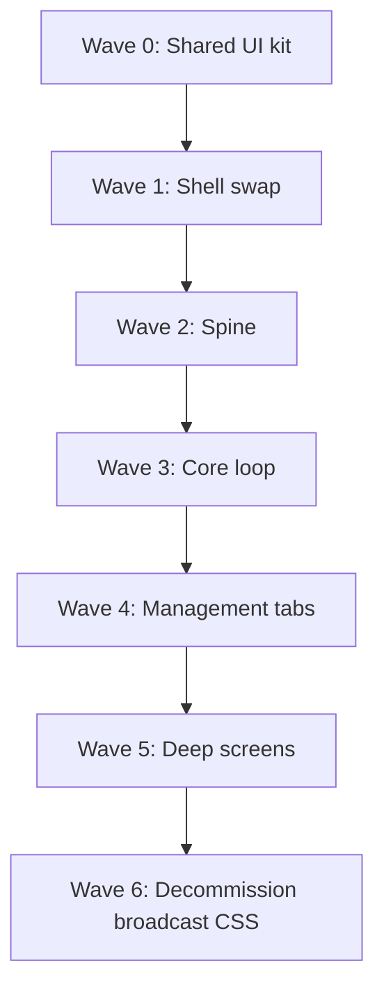

# Dynasty Full-App Migration — MVD Audit

**Minimum Viable Delta (MVD)** — structured assessment of what it takes to move Next GM from the broadcast command-center UI (`:5174`) to the Dynasty visual system proven in [`prototypes/dynasty-game`](../../prototypes/dynasty-game) (`:5183`).

**Audit date:** 2026-05-22  
**Scope:** Audit only — no production code changes.  
**Compare surfaces:**

| Surface | Path | Role |
|---------|------|------|
| Dynasty prototype | [`prototypes/dynasty-game/`](../../prototypes/dynasty-game/) | Visual north star — 15 scenes, ~835 lines Dynasty CSS |
| Production app | [`src/App.tsx`](../../src/App.tsx) (~11,496 lines) + [`src/screens/MarketScreen.tsx`](../../src/screens/MarketScreen.tsx) (245 lines) | Real game logic, handlers, persistence |
| Dynasty CSS | [`prototypes/dynasty-game/src/styles/bridge.css`](../../prototypes/dynasty-game/src/styles/bridge.css) (431 lines), [`pages.css`](../../prototypes/dynasty-game/src/styles/pages.css) (404 lines) | Dynasty tokens + per-screen grids |
| Broadcast CSS | [`src/styles.css`](../../src/styles.css) (~12,303 lines; 36 `dashboard-command` / `gameplay-command` / `broadcast-theme` rule blocks) | Current production styling |
| Design contract | [`DESIGN.md`](../../DESIGN.md) | Canonizes **broadcast command center**, not Dynasty |

---

## Executive Summary

| Metric | Estimate | Notes |
|--------|----------|-------|
| **Visual shell coverage** | **~68%** | Dynasty chrome + grid layouts exist for all 15 screens; depth varies from rich (Dashboard) to placeholder (Championships, Season Review) |
| **Layout region coverage** | **~55%** | Top HUD and primary stage mostly mapped; side rails, tactical grids, and lower-third strips are simplified or absent on 8+ screens |
| **Interaction coverage** | **~22%** | Nav spine + a few CTAs wired; no segment CRUD, draft picks, market transactions, title/rivalry management, or save CRUD |
| **Data / read-model coverage** | **~30%** | `buildDashboardModel` + partial post-show handoff reads; most screens use raw `GameState` slices instead of production context reads |

**Bottom line:** The prototype proves the Dynasty *look* across the full app map. The migration work is dominated by **interaction wiring and read-model extraction from `App.tsx`**, not CSS. Wave 0–2 (shared kit + shell + spine) delivers a playable Dynasty-skinned loop for Title → Dashboard → Booking → Show Recap without touching the heaviest screens (Setup draft, Championships, Season Review).

### Product decision required

[`DESIGN.md`](../../DESIGN.md) mandates a *premium dark sports broadcast command center*. Dynasty is a distinct visual dialect (panel-forward HQ desk, promo backdrops, scroll lists) that still reuses broadcast header tokens via `getBroadcastThemeClass`. Before Wave 1:

- **Option A:** Update `DESIGN.md` + [`docs/ui-broadcast-command-center-style.md`](../ui-broadcast-command-center-style.md) to canonize Dynasty as the primary skin.
- **Option B:** Treat Dynasty as an alternate theme (`data-ui-skin="dynasty"`) and maintain both CSS stacks until Wave 6 decommission.

---

## Comparison Baseline

### Prototype architecture

```
prototypes/dynasty-game/src/
  DynastyGameApp.tsx          # playthrough router + fixture phases
  shell/DynastyShell.tsx      # header HUD + GameNav (reuses @components/gameShell)
  shell/PlaythroughBar.tsx    # phase picker (dev-only; not for production)
  scenes/                     # 15 visual scenes (~1,188 lines total)
  adapters/buildDashboardModel.ts   # 358 lines — only formal adapter
  components/DynastyPanel.tsx       # panel primitives
  components/DynastyPortrait.tsx    # wraps SuperstarPortrait
  components/ShowScoreChart.tsx
  fixtures/                   # live-desk snapshots (week-pressure, go-home-ple, post-show-fallout)
  styles/bridge.css           # shell, portraits, dashboard overflow, theme bridge
  styles/pages.css            # per-screen CSS grids (~78 `.dynasty-*` selectors)
```

**Prototype constraints:** No localStorage, no `runShow` simulation, no state mutation on Advance Week. Fixtures drive pre/post-show context.

### Production architecture

```
src/
  App.tsx                     # 14 inline screen components + all handlers (~5,500 lines of UI)
  screens/MarketScreen.tsx    # only extracted gameplay screen (+ MarketScreen.css 459 lines)
  styles.css                  # monolithic broadcast CSS
  components/                 # GameNav, SuperstarPortrait, broadcast panels, SegmentComposer, etc.
  game/                       # @game read models, sim, persistence
```

**Screen size in production (lines per function in App.tsx):**

| Screen | Lines |
|--------|------:|
| NewGameSetupScreen | 1,121 |
| SeasonReviewScreen | 657 |
| BookingScreen | 676 |
| ChampionshipsScreen | 522 |
| WrestlerProfileScreen | 413 |
| DashboardScreen | 379 |
| RivalriesScreen | 354 |
| FinanceScreen | 332 |
| RosterScreen | 252 |
| MarketScreen (file) | 245 |
| ResultsScreen | 199 |
| TitleScreen | 149 |
| SocialScreen | 101 |
| CalendarScreen | 92 |

---

## Parity Matrix — 15 Screens × 4 Dimensions

Legend: **P** = Present · **~** = Partial · **—** = Missing

| Screen | A Visual | B Layout | C Interactions | D Data | Effort | Wave |
|--------|:--------:|:--------:|:--------------:|:------:|:------:|:----:|
| Title | ~ | ~ | — | — | **M** | 2 |
| Setup | ~ | ~ | — | — | **XL** | 3 |
| Dashboard | ~ | ~ | ~ | ~ | **M** | 2 |
| Booking | ~ | ~ | — | ~ | **XL** | 3 |
| Results | ~ | ~ | ~ | ~ | **M** | 2 |
| Roster | ~ | ~ | ~ | — | **M** | 4 |
| Market | ~ | ~ | — | ~ | **M** | 4 |
| Profile | ~ | ~ | ~ | — | **L** | 4 |
| Finance | ~ | ~ | — | ~ | **M** | 4 |
| Calendar | ~ | P | — | ~ | **S** | 4 |
| Social | ~ | P | — | ~ | **S** | 4 |
| Rivalries | ~ | ~ | — | — | **L** | 5 |
| Championships | — | — | — | — | **XL** | 5 |
| Season Review | — | ~ | — | — | **XL** | 5 |

### Per-screen detail

#### 1. Title

| Dimension | Production | Prototype | Gap |
|-----------|----------|-----------|-----|
| **Visual** | Hero + career deck, save cards | `dynasty-title-grid`, mock save rows | Save card actions styled but non-functional |
| **Layout** | 2-col title shell | 2-col Dynasty grid | Matches |
| **Interactions** | Continue, New Career, Load/Rename/Delete saves | Continue → fixture; New Career → setup stub | No save CRUD, no save-limit enforcement |
| **Data** | `careerSaves`, `gameStorage`, preview hydration | `mockCareerSaves` fixture | Full persistence layer missing |

**Monolith tax:** L (inline in App.tsx)

#### 2. Setup (New Career)

| Dimension | Production | Prototype | Gap |
|-----------|----------|-----------|-----|
| **Visual** | 5-step wizard + draft war room (HUD, 3-col board, 6 bottom panels) | Step rail + simplified draft rows | Draft war room depth missing (~80% of production UI) |
| **Layout** | Step rail / workspace / summary rail; full-screen draft mode | `dynasty-setup-grid` 3-col | Summary rail, draft bottom band absent |
| **Interactions** | GM/brand/rules forms, CPU draft sim, pick/undo/reset, Enter Week 1 | Step nav, complete jumps to fixture | No `createNewGame`, no CPU draft, inputs not persisted |
| **Data** | `draftPool`, `getCpuDraftPreviewSnapshot`, budget math, rival assignments | `draftPool` display only | Entire career creation pipeline missing |

**Monolith tax:** L (1,121 lines inline)

#### 3. Dashboard

| Dimension | Production | Prototype | Gap |
|-----------|----------|-----------|-----|
| **Visual** | 3-col command room, telemetry strip, pressure tags | 3-col Dynasty panels, promo backdrop, chart | Missing CPU feed, IWC mood, detailed pressure breakdown |
| **Layout** | HUD + left/center/right rails + bottom telemetry | `dynasty-page-grid` 3-col | Bottom telemetry strip simplified to roster footer |
| **Interactions** | Primary CTA routes weekReview vs booking; read-only panels | Nav CTAs wired; rows not clickable | Alert/champion/rivalry deep links missing |
| **Data** | 15+ context reads (PLE, living world, brand pulse, timing snapshots) | `buildDashboardModel` adapter (358 lines) | Adapter covers ~60% of production reads |

**Monolith tax:** L · **Reference implementation** for adapter pattern

#### 4. Booking

| Dimension | Production | Prototype | Gap |
|-----------|----------|-----------|-----|
| **Visual** | Board mode + setup mode, segment composer, production details | Rundown + stub composer + roster desk | No board/setup mode toggle, no slot grid |
| **Layout** | Board shell or focused setup shell | `dynasty-booking-grid` 2×2 | Segment composer is display-only |
| **Interactions** | Add/edit/remove segments, smart rundown, participant toggles, stipulations, Run Show with validation | Run Show → phase skip only | Entire segment mutation pipeline missing |
| **Data** | `SegmentComposer`, catalog/stipulation, readiness, producer notes | `isValidSegment` count, segment[0] preview | Smart rundown, validation UX, focus deep-link |

**Monolith tax:** L (676 lines + SegmentComposer helpers)

#### 5. Results

| Dimension | Production | Prototype | Gap |
|-----------|----------|-----------|-----|
| **Visual** | Recap package, cause ledger, broadcast fallout, segment breakdown | Hero + ledger rows + ratings summary | Collapsible panels, injury/overrun sections missing |
| **Layout** | Recap + side panels + collapsible lists | `dynasty-results-grid` | Rival intel / CPU feed rails absent |
| **Interactions** | Advance Week / Season Review from compact handoff; expand/collapse sections | Nav to dashboard / recap | Direct calendar action wiring |
| **Data** | `buildResultsRecapPackage`, cause ledger, broadcast fallout snapshots | Fixture `ShowResult` + `getShowGrade` | Requires live post-`runShow` result |

**Monolith tax:** L

#### 6. Show Recap Handoff

| Dimension | Production | Prototype | Gap |
|-----------|----------|-----------|-----|
| **Visual** | Compact GM handoff inside Show Recap | Handoff panel | Social/rival pressure simplified |
| **Layout** | Recap + segment inspection + handoff band | `dynasty-results-grid` | Handoff should stay viewport-fit |
| **Interactions** | Advance Week → `advanceGameWeek`; season review at week 50 | Advance → playthrough toast (no mutation) | Real week advance + save required |
| **Data** | `getPostShowOfficeSnapshot`, `getPostShowHandoffSnapshot` | Same read models used | Finance rollup from `game.financeReports` — partial |

**Monolith tax:** L

#### 7. Roster

| Dimension | Production | Prototype | Gap |
|-----------|----------|-----------|-----|
| **Visual** | 4-region command board, morale SVG trend, wrestler cards | Table + selected detail + affiliations placeholder | No morale trend chart, no card grid |
| **Layout** | Filter rail / board stage / pulse rail / selected dock | `dynasty-roster-grid` 3-col | Filter rail and pulse rail absent |
| **Interactions** | 9 filters, sort, search, card select, View Profile, Book Show | Row select + profile + dashboard | Filters, search, booking shortcut missing |
| **Data** | `getRosterMoraleTrend`, pressure tags, identity snapshots | Raw wrestler sort + hardcoded role icon | Roster context reads not wired |

**Monolith tax:** L

#### 8. Market

| Dimension | Production | Prototype | Gap |
|-----------|----------|-----------|-----|
| **Visual** | 4-region command board (talent rail, focus stage, action rail, feed) | Free agents + scout + trade desk + ledger | Office mandate, trade builder UI simplified |
| **Layout** | CSS grid command board | `dynasty-market-grid` 2×2 | Bottom mandate + feed band missing |
| **Interactions** | Sign, Release, Propose Trade with guards | Finance nav only | All transaction handlers missing |
| **Data** | `getMarketSnapshot`, contract reads, rival events | `getMarketSnapshot` display | Parent callbacks not wired |

**Monolith tax:** **S** (already extracted to `MarketScreen.tsx`)

#### 9. Profile

| Dimension | Production | Prototype | Gap |
|-----------|----------|-----------|-----|
| **Visual** | Hero + multi-panel expandable layout (stats, contract, GM read, history) | Hero + championships + locker read | 6+ production panels reduced to 3 |
| **Layout** | Main + side expandable columns | `dynasty-profile-grid` 2-col | Expand/collapse panel system missing |
| **Interactions** | Back to booking/roster; panel expand | Back + book nav (no segment assign) | Return-screen context partial |
| **Data** | 10+ wrestler-specific reads (GM read, title history, social, appearances) | Championships filter + static locker copy | Most story/roster context reads missing |

**Monolith tax:** L

#### 10. Finance

| Dimension | Production | Prototype | Gap |
|-----------|----------|-----------|-----|
| **Visual** | Summary strip + expandable office panels | Hero + report ledger | Talent value, season reads, breakdown grids missing |
| **Layout** | Stacked expandable panels | `dynasty-finance-grid` 2-col | Single-column office desk absent |
| **Interactions** | Expand/collapse panels only (read-only) | None | Panel expand state |
| **Data** | `getFinanceOfficeRead`, breakdown helpers, talent pressure | `getFinancePressureLabel` + report list | Office read and breakdown helpers missing |

**Monolith tax:** L

#### 11. Calendar

| Dimension | Production | Prototype | Gap |
|-----------|----------|-----------|-----|
| **Visual** | Hero + PLE pressure + week cards with results | Week tile grid | PLE countdown, ratings/CPU side panels missing |
| **Layout** | Hero + list | `dynasty-calendar-grid` single panel | Compact side intel absent |
| **Interactions** | Book Show CTA | None | Week tiles not clickable |
| **Data** | `getPleBuildPressureSnapshot`, week result matching | Raw calendar weeks | PLE/readiness context missing |

**Monolith tax:** L · **Fast win** candidate

#### 12. Social

| Dimension | Production | Prototype | Gap |
|-----------|----------|-----------|-----|
| **Visual** | IWC mood panel + category filters + feed | Filter chips (static) + post list | Mood aggregation panel missing |
| **Layout** | Hero + filter bar + feed | `dynasty-social-grid` | Side panels absent |
| **Interactions** | Category filter buttons | None | Filter wiring |
| **Data** | `getIwcMoodSummary`, category mapping | Raw `socialPosts` slice | Mood summary missing |

**Monolith tax:** L · **Fast win** candidate

#### 13. Rivalries

| Dimension | Production | Prototype | Gap |
|-----------|----------|-----------|-----|
| **Visual** | 3-col desk + spotlight VS stage + composer + creative desk band | List + create desk stub | Matchup stage, story map, metrics missing |
| **Layout** | Active rail / spotlight / composer + ecosystem band | `dynasty-rivalries-grid` 2-col | Composer and creative desk absent |
| **Interactions** | Select, create, end, book rivalry; structure/stakes forms | None | Full rivalry CRUD missing |
| **Data** | `getRivalryCreativeDeskRead`, timing snapshots, validation | Raw rivalries list | All context reads missing |

**Monolith tax:** L

#### 14. Championships

| Dimension | Production | Prototype | Gap |
|-----------|----------|-----------|-----|
| **Visual** | Title wall + focus workspace + tabs + office panel | One panel per belt, fake contenders | ~90% of production UI missing |
| **Layout** | Wall / focus / footer office | `dynasty-championships-grid` card grid | Focus workspace with tabs absent |
| **Interactions** | Assign/revoke champion, contender reorder, book title | None | Full title office missing |
| **Data** | `getTopContenders`, office read, scene pressure | First 4 roster members as fake contenders | All title logic missing |

**Monolith tax:** L · **Largest visual gap**

#### 15. Season Review

| Dimension | Production | Prototype | Gap |
|-----------|----------|-----------|-----|
| **Visual** | Legacy snapshot, archive, rivalry spotlight, belt grid | Hero metrics + archive placeholder | Multi-section season retrospective missing |
| **Layout** | Plain app-shell (no GameNav) | `dynasty-season-grid` inside shell | Production omits nav — prototype includes it |
| **Interactions** | Start Next Season | Toast stub | `startNextSeason` missing |
| **Data** | Season archives, hottest rivalry, biggest title change, PLE payoff | Client-side averages only | All legacy aggregations missing |

**Monolith tax:** L · Not on prototype playthrough spine

---

## Cross-Cutting Architecture Audit

| Layer | Prototype | Production | Delta | Strategy |
|-------|-----------|------------|-------|----------|
| **Router / shell** | `DynastyGameApp` + `DynastyShell` | Inline `App.tsx` + `gameplay-command-shell` | Extract shell to `src/ui/dynasty/`; replace root classNames on gameplay screens | Namespace `.dynasty-game-shell` alongside existing shell during transition |
| **CSS systems** | 835 lines (`bridge.css` + `pages.css`) | 12,303 lines (`styles.css`) + 459 lines (`MarketScreen.css`) | 15:1 ratio — production has deep per-screen broadcast rules | **Coexistence:** import Dynasty CSS as additive layer; map screen-by-screen; delete broadcast rules in Wave 6 |
| **Components** | `DynastyPanel`, `DynastyPortrait`, `ShowScoreChart` | `SuperstarPortrait`, `SegmentComposer`, `WrestlerCard`, broadcast panels | Portrait already shared via wrapper; composer/cards need Dynasty skins or replacements | Promote `DynastyPanel` to `src/ui/dynasty/`; wrap existing composers before rewriting |
| **Adapters** | `buildDashboardModel.ts` (358 lines) | Inline derivations per screen in `App.tsx` | One adapter vs dozens of inline reads | Replicate adapter pattern: `buildBookingModel`, `buildRosterModel`, etc. |
| **Navigation** | `GameNav` from `@components/gameShell` | Same component | Low risk | Already shared |
| **Themes** | `getBroadcastThemeClass` in shell | `broadcast-theme-*` on main | Already bridged in prototype | Verify all brand skins in Dynasty bridge |
| **Persistence / sim** | Fixtures only | Full career save + `runShow` + `advanceWeek` | Out of visual scope but blocks "done" | Wire handlers before declaring screen migrated |
| **Monolith** | N/A | 14/15 screens in `App.tsx` | Extraction tax on every wave | Extract screen + adapter together per wave |

### CSS mapping notes

- **Dynasty `pages.css`** defines grid shells for every screen: `dynasty-booking-grid`, `dynasty-roster-grid`, `dynasty-market-grid`, etc.
- **Production** uses parallel `*-command-shell` / `*-command-board` patterns (`dashboard-command-*`, `roster-command-*`, `market-command-*`, etc.).
- Migration path: swap outer grid class on each screen, then replace inner `command-panel` markup with `DynastyPanel` incrementally.
- **Scroll contract:** Prototype enforces no document scroll at 1280×720 via `bridge.css` overflow rules; production uses contained panel scroll in many places — verify per screen during migration.

### Shared component inventory

| Prototype component | Production equivalent | Action |
|--------------------|-----------------------|--------|
| `DynastyPanel` | `command-panel` + `section-heading` | Promote to shared; map props |
| `DynastyPortrait` | `SuperstarPortrait` | Already wraps production component |
| `ShowScoreChart` | Inline chart in dashboard | Promote or reuse |
| `DynastyMetricGrid` | `Metric` / `status-grid` | Promote |
| `DynastyScrollList` | Various list containers | Promote |
| — | `SegmentComposer` | Dynasty skin or rebuild layout |
| — | `WrestlerCard` | Dynasty card variant needed |
| — | `ProfileExpandablePanel` | Map to `DynastyPanel` + collapse |
| — | `FinanceExpandablePanel` | Same |
| — | `RivalIntelligencePanel`, `RatingsBattlePanel`, `CpuResultsFeedPanel` | Restyle or embed in Dynasty rails |

---

## Effort Scoring

### Rubric

```
Total effort ≈ Visual + (Interaction × 2) + Data + MonolithTax
```

| Tag | Meaning | Typical scope |
|-----|---------|---------------|
| **S** | Small | CSS swap + read-only data already available; < 1 day |
| **M** | Medium | Layout restructure + partial handlers; 1–3 days |
| **L** | Large | New adapter + most interactions; 3–5 days |
| **XL** | Extra large | Major screen rebuild or 500+ lines logic extraction; 5–10+ days |

MonolithTax: **+L** for App.tsx inline screens · **+S** for `MarketScreen.tsx`

### Screen effort summary

| Effort | Screens |
|--------|---------|
| **S** | Calendar, Social |
| **M** | Title, Dashboard, Show Recap, Roster, Market, Finance |
| **L** | Profile, Rivalries |
| **XL** | Setup, Booking, Championships, Season Review |

**Estimated total:** ~55–75 dev-days for full parity (visual + interactions + data), assuming sequential extraction. Waves 0–2 alone: ~8–12 days.

---

## Top 10 Gaps (by player impact × effort)

Ranked by what blocks a shippable Dynasty experience:

| Rank | Gap | Impact | Effort | Screens |
|:----:|-----|--------|--------|---------|
| 1 | **Segment composer + booking board** — core gameplay loop | Critical | XL | Booking |
| 2 | **New career / draft war room** — entry point for new players | Critical | XL | Setup |
| 3 | **Championship title office** — assign/contend/book flows | High | XL | Championships |
| 4 | **`App.tsx` monolith extraction** — blocks parallel work | High | L (cross-cutting) | All |
| 5 | **Market sign/release/trade handlers** | High | M | Market |
| 6 | **Rivalry create/book/end composer** | High | L | Rivalries |
| 7 | **Dashboard adapter completeness** — pressure/PLE/CPU feeds | Medium | M | Dashboard |
| 8 | **Career save CRUD on title screen** | Medium | M | Title |
| 9 | **Profile + roster context reads** — management depth | Medium | L | Profile, Roster |
| 10 | **Season review + next season rollover** | Medium | XL | Season Review |

**Honorable mentions:** Show Recap direct `advanceWeek` wiring (M); Results cause ledger / fallout panels (M); Finance expandable breakdowns (M); CSS dual-stack maintenance cost (cross-cutting).

---

## Recommended Migration Waves



### Wave 0 — Shared UI kit

**Goal:** Promote reusable Dynasty primitives into production tree.

**Deliverables:**
- `src/ui/dynasty/DynastyPanel.tsx` (from prototype)
- `src/ui/dynasty/DynastyPortrait.tsx` (already wraps `SuperstarPortrait`)
- `src/ui/dynasty/ShowScoreChart.tsx`
- `src/ui/dynasty/styles/bridge.css` + `pages.css` imported from main app entry
- Document adapter pattern using `buildDashboardModel.ts` as template

**Exit criteria:** Main app builds with Dynasty CSS loaded but no screen switched yet; Storybook or static render of `DynastyPanel` variants optional.

---

### Wave 1 — Shell swap

**Goal:** Replace gameplay shell wrapper without changing screen internals.

**Deliverables:**
- Extract `DynastyShell` to `src/ui/dynasty/DynastyShell.tsx`
- Feature flag or env `VITE_UI_SKIN=dynasty` toggles root classNames
- Header HUD wired to live `GameState` via `buildDashboardModel`
- `GameNav` unchanged

**Exit criteria:** All screens render inside Dynasty shell with **existing** broadcast panel markup; header HUD shows live data; brand themes apply.

---

### Wave 2 — Spine (Title → Dashboard → Show Recap)

**Goal:** Playable Dynasty-skinned weekly loop with real sim.

| Screen | Work |
|--------|------|
| Title | Dynasty layout + wire save CRUD |
| Dashboard | Port `DashboardScene` layout; complete adapter reads; wire primary CTA routing |
| Show Recap | Port recap layout; wire cause ledger, fallout, compact GM handoff, and `advanceWeek` / season review branch |

**Exit criteria:** New or continued career → book (existing booking UI ok) → run show → Show Recap + GM Handoff → advance week works at 1280×720 with Dynasty chrome on spine screens. No document scroll on spine.

**What the player gets if you stop here:** Dynasty look on title, HQ, and Show Recap; booking/setup/management tabs still broadcast-styled internally.

---

### Wave 3 — Core loop (Booking + Setup)

**Goal:** Dynasty visual + full interactions for show building and career start.

| Screen | Work |
|--------|------|
| Booking | Extract `BookingScreen` from App.tsx; port board + setup modes; Dynasty grid; wire `SegmentComposer` |
| Setup | Extract `NewGameSetupScreen`; port draft war room to Dynasty; wire CPU draft + `createNewGame` |

**Exit criteria:** New career through draft → book card with segment CRUD → run show completes full loop in Dynasty UI.

---

### Wave 4 — Management tabs

**Goal:** Dynasty styling + handlers for roster operations and economy.

| Screen | Effort | Notes |
|--------|--------|-------|
| Roster | M | Filters, search, morale trend, dock |
| Market | M | Already extracted — swap layout + wire handlers |
| Profile | L | Expandable panels + context reads |
| Finance | M | Expandable breakdown panels |
| Calendar | S | PLE pressure + week cards |
| Social | S | Mood panel + filters |

**Exit criteria:** All GameNav tabs reachable with Dynasty layout and production-equivalent read-only or transactional behavior.

---

### Wave 5 — Deep screens

**Goal:** Highest-complexity management surfaces.

| Screen | Work |
|--------|------|
| Championships | Full title wall + focus workspace + contender board + assign/book |
| Rivalries | 3-col desk + composer + creative desk |
| Season Review | Legacy snapshot, archive, start next season; omit GameNav per production |

**Exit criteria:** Title office and rivalry desk parity with `:5174` behavior; season rollover works.

---

### Wave 6 — Decommission broadcast CSS

**Goal:** Remove duplicate styling debt.

**Deliverables:**
- Delete unused `*-command-*` rules from `styles.css` per migrated screen
- Update `DESIGN.md` to Dynasty-canonical (if Option A chosen)
- Remove feature flag; Dynasty is default
- Archive or delete `prototypes/dynasty-game` playthrough bar dev UI

**Exit criteria:** No dead CSS for migrated screens; bundle size reduction measurable; `:5174` runs Dynasty-only.

---

## `@game` Read-Model Coverage Map

Screens needing new adapters (beyond `buildDashboardModel`):

| Adapter (proposed) | Primary `@game` modules | Used by |
|--------------------|-------------------------|---------|
| `buildDashboardModel` ✅ | scoring, gameContextReads, rosterContextReads, finance, market, cpuRivalLoop | Dashboard, Shell |
| `buildBookingModel` | matchFormatCatalog, stipulationCatalog, scoring, rosterContextReads | Booking |
| `buildSetupDraftModel` | seed, cpuRivalLoop, financeCatalog | Setup |
| `buildRosterModel` | rosterContextReads, affiliationCatalog | Roster |
| `buildProfileModel` | rosterContextReads, storyContextReads, rivalryCatalog, affiliationCatalog | Profile |
| `buildMarketModel` | market, financeCatalog, formatters | Market |
| `buildFinanceModel` | finance, financeCatalog | Finance |
| `buildResultsModel` | scoring, gameContextReads | Results |
| `buildPostShowHandoffModel` | gameContextReads, rosterContextReads, scoring | Show Recap handoff |
| `buildChampionshipsModel` | storyContextReads, titleCatalog | Championships |
| `buildRivalriesModel` | rivalryCatalog, storyContextReads, scoring | Rivalries |
| `buildSeasonReviewModel` | cpuRivalLoop, scoring, season archives | Season Review |

---

## Validation Checklist (per migrated screen)

Use for each wave before marking a screen done:

- [ ] 1280×720 — no document scroll
- [ ] 1100×720 — no document scroll
- [ ] Pre-show / post-show information boundaries respected ([`DESIGN.md`](../../DESIGN.md))
- [ ] All primary actions functional (not stub)
- [ ] Brand theme class applies (`getBroadcastThemeClass`)
- [ ] Portraits load from `/superstars/{id}.png`
- [ ] Keyboard / QA harness behavior preserved (if applicable)
- [ ] Save persistence unchanged after mutations
- [ ] Side-by-side with `:5183` scene — layout regions match

---

## Appendix — Prototype Scene File Index

| Scene file | Lines | CSS grid class |
|------------|------:|----------------|
| `DashboardScene.tsx` | 301 | `dynasty-page-grid` |
| `SetupScene.tsx` | 146 | `dynasty-setup-grid` |
| `BookingScene.tsx` | 103 | `dynasty-booking-grid` |
| `RosterScene.tsx` | 87 | `dynasty-roster-grid` |
| `ResultsScene.tsx` | 84 | `dynasty-results-grid` |
| `MarketScene.tsx` | 73 | `dynasty-market-grid` |
| `WeekReviewScene.tsx` | 76 | `dynasty-week-review-grid` |
| `TitleScene.tsx` | 56 | `dynasty-title-grid` |
| `ProfileScene.tsx` | 59 | `dynasty-profile-grid` |
| `FinanceScene.tsx` | 43 | `dynasty-finance-grid` |
| `RivalriesScene.tsx` | 41 | `dynasty-rivalries-grid` |
| `SeasonReviewScene.tsx` | 35 | `dynasty-season-grid` |
| `ChampionshipsScene.tsx` | 31 | `dynasty-championships-grid` |
| `SocialScene.tsx` | 31 | `dynasty-social-grid` |
| `CalendarScene.tsx` | 22 | `dynasty-calendar-grid` |

---

## Appendix — Run Commands

```bash
# Dynasty prototype (visual north star)
cd "Next GM V2/prototypes/dynasty-game" && npm run dev   # :5183

# Dashboard-only reference
cd "Next GM V2/prototypes/dynasty-hq" && npm run dev     # :5182

# Production app (unchanged)
cd "Next GM V2" && npm run dev                           # :5174
```

Side-by-side audit: open both `:5183` and `:5174` at 1280×720; use prototype Playthrough spine then free-roam GameNav tabs.
